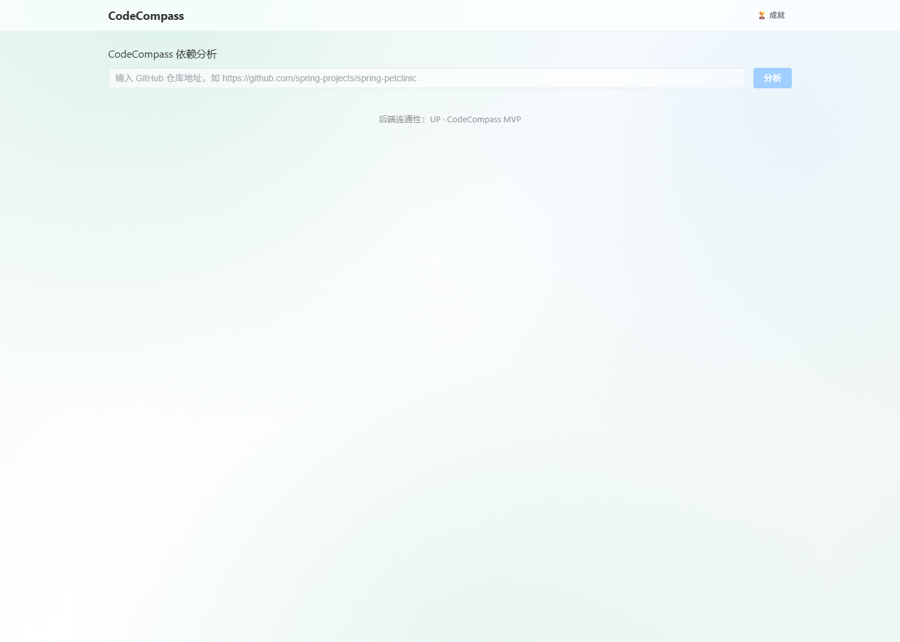
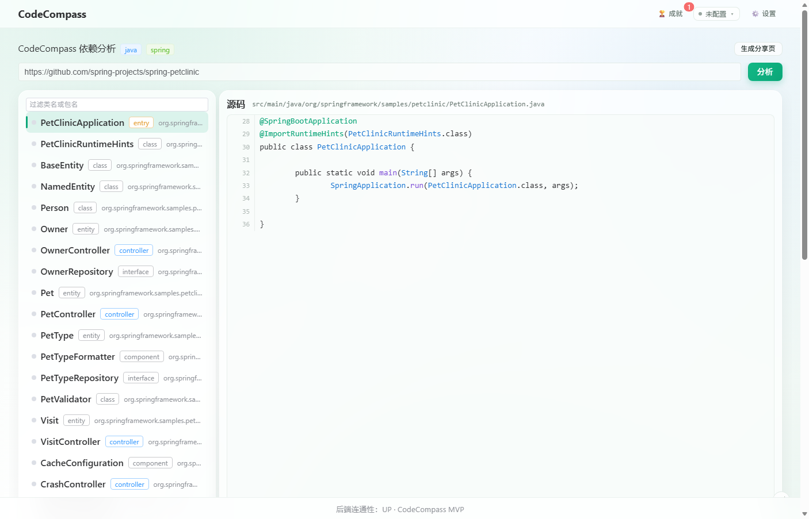
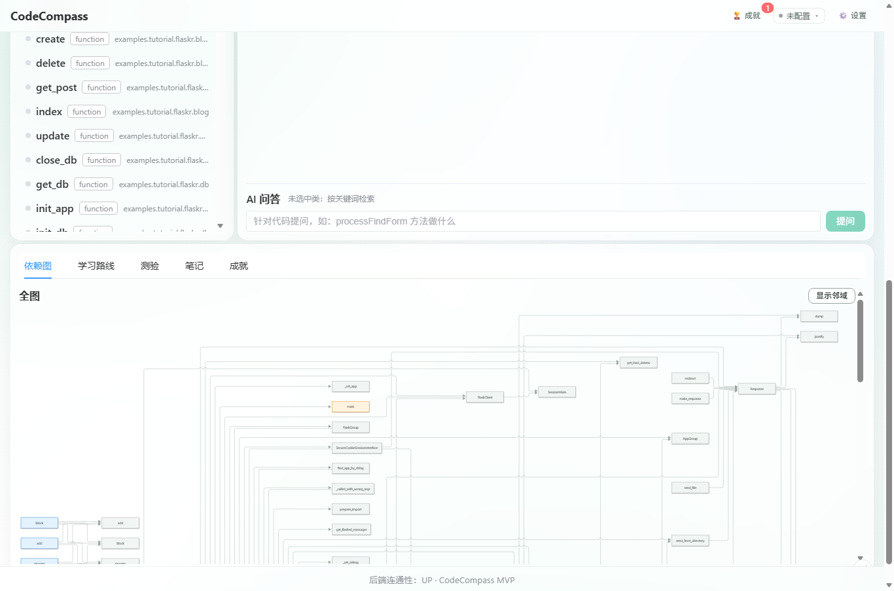
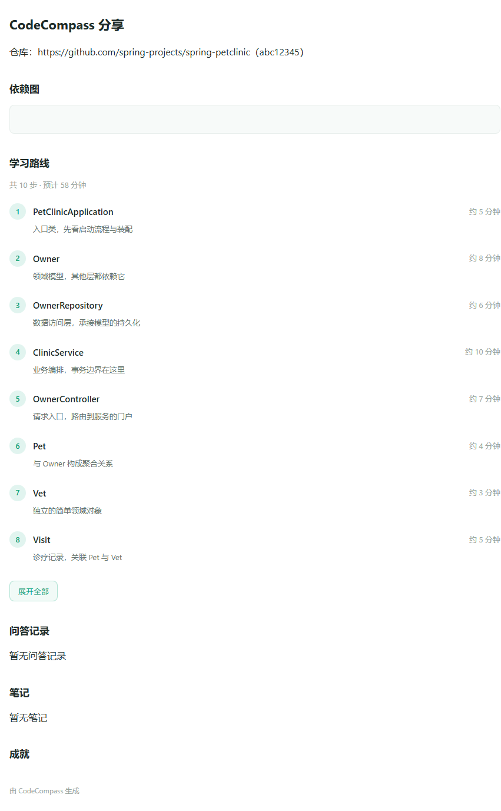

# CodeCompass

> AI 驱动的开源项目领读平台 —— 输入一个 GitHub 仓库，自动生成**类级依赖图**、**学习路线**、**AI 问答**与**自动测验**，帮你快速读懂陌生代码。

[](https://openjdk.org/)
[](https://spring.io/projects/spring-boot)
[](https://vuejs.org/)
[](LICENSE)

## 功能清单

| 功能 | 说明 |
|---|---|
| 📦 仓库分析 | 输入 GitHub 仓库地址，自动浅克隆、多语言扫描、解析出**类级依赖图**（Mermaid 渲染，点类看邻域） |
| 🗺️ 学习路线 | 按入口类优先、依赖入度排序生成**环安全**的学习路线，每步带生成式说明 |
| 💬 AI 问答 | 基于检索的代码问答，回答带**可跳转的真实行号引用**（不编行号） |
| 📝 自动测验 | 选中类自动生成单选 / 判断题（引用落点校验），自动判分与错题解析 |
| 🧑‍🎓 笔记 · 进度 · 成就 | 匿名身份（Cookie）、按单元记笔记、学习进度持久化、5 类成就徽章 |
| 🔗 分享领读页 | 一键生成短链，无 Cookie 可打开，内容脱敏（无源码、无 key） |
| 🌍 多语言 | 内置 Java + Python 解析器，架构上「加语言只加一个实现 + 一行配置」 |
| 🔑 自填 LLM key | 多套 LLM 配置一键切换；key **只存浏览器 localStorage**，不落库、不进日志 |

## 截图

| 首页 | 源码解析 |
|---|---|
|  |  |

| 依赖图 | 分享页 |
|---|---|
|  |  |

## 技术栈

| 层 | 技术 |
|---|---|
| 后端 | Java 21 · Spring Boot 4.1.1 · Maven · Flyway · Spring Data JPA |
| 前端 | Vue 3 · Vite · TypeScript · Pinia · Element Plus · Mermaid |
| 解析 | JavaParser（Java）· ANTLR4 + grammars-v4（Python） |
| 存储 | MySQL 8（生产）· 内存 H2（零依赖开发，`MODE=MySQL`） |
| LLM | OpenAI 兼容协议（DeepSeek / OpenAI / 本地 Ollama） |

## 快速开始

> 前置：JDK 21、Maven 3.9+、Node 18+（前端）。数据库可选 —— 不装 MySQL 也能跑。

### 方式一：不连数据库（最简单）

后端缺省用**内存 H2**，`DB_URL / DB_USER / DB_PASSWORD` 三个都不设即可，进程退出数据即消失：

```bash
mvn -f backend/pom.xml -DskipTests package
java -jar backend/target/codecompass-backend-0.0.1-SNAPSHOT.jar
```

### 方式二：连接 MySQL 8

```bash
# 环境变量（密码用你自己的，别提交真实值）
#   DB_URL=jdbc:mysql://127.0.0.1:3306/codecompass?useSSL=false&allowPublicKeyRetrieval=true&serverTimezone=Asia/Shanghai&characterEncoding=utf8
#   DB_USER=...  DB_PASSWORD=...
# LLM key（也可在前端「设置」抽屉里填，二选一）
#   CODESCOMPASS_LLM_API_KEY=sk-...

java -jar backend/target/codecompass-backend-0.0.1-SNAPSHOT.jar \
  --codecompass.llm.base-url=https://api.deepseek.com/v1 \
  --codecompass.llm.model=deepseek-chat \
  --codecompass.llm.provider=deepseek
```

### 前端

```bash
cd frontend
npm install
npm run dev        # Windows 上 npm.ps1 被执行策略拦截时用：cmd /c "npm run dev"
```

浏览器打开 `http://localhost:5173`（dev server 已代理 `/api` 与 `/share` 到 `:8080`）。

### 一键自检（不连数据库能否裸跑）

```powershell
powershell -ExecutionPolicy Bypass -File backend/scripts/verify-standalone-jar.ps1 -Build
```

### 测试

```bash
mvn -f backend/pom.xml test                          # 单元测试（H2，可离线）
mvn -f backend/pom.xml test -Dsurefire.excludedGroups=   # 含集成测试（真机克隆 + MySQL + 真实 LLM，需网络）
```

## 架构一览

解析层对业务层**语言中立**：`LanguageAnalyzer` / `UnitRoleAnnotator` 接口 + 注册表查表，业务层不 import 任何语言实现；「扫描哪些文件 / 哪个源码根」由 `codecompass.scan.sources` 配置驱动。

```
backend/
  src/main/java/com/codecompass/
    analyzer/        # LanguageAnalyzer 接口 + java/ + python/ 实现
    repo/            # 克隆（稀疏检出 + 看门狗 + 终检）、扫描、临时工作区
    service/         # 编排、问答、测验、路线、成就、LLM 客户端（SSRF 守卫）
    web/             # REST 控制器 + DTO
  src/main/resources/
    application.yml  # 数据源 / LLM / 扫描 / 成就 全部配置（密钥走环境变量）
    db/migration/    # Flyway 迁移（H2 MODE=MySQL 与 MySQL 8 双通）
frontend/
  src/api  src/stores  src/components  src/views  src/utils
```

## 文档

| 文档 | 内容 |
|---|---|
| [`docs/PROGRESS.md`](docs/PROGRESS.md) | 开发进度与关键决策 |
| [`docs/BACKEND_OVERVIEW.md`](docs/BACKEND_OVERVIEW.md) | 后端 14 个功能与实现 |
| [`docs/TEST_REPORT.md`](docs/TEST_REPORT.md) | 七层测试报告 |
| [`docs/TASKBOOK.md`](docs/TASKBOOK.md) | MVP 任务书（需求来源） |

## License

[MIT](LICENSE) © 2026
